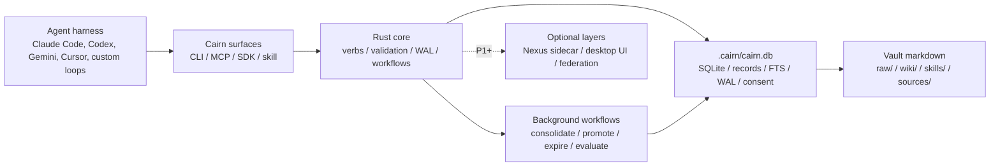

<div align="center">
  
  <h1>Cairn</h1>
  <p><strong>Standalone, harness-agnostic memory for AI agents.</strong></p>
  <p>
    Local-first vaults. A stable eight-verb contract. Durable learning off the request path.
  </p>
</div>

---

> **Status:** Pre-v0.1. The P0 Rust workspace scaffold is in place (eight crates: `cairn-core`, `cairn-cli`, `cairn-mcp`, `cairn-store-sqlite`, `cairn-sensors-local`, `cairn-workflows`, `cairn-idl`, `cairn-test-fixtures`). No verb behaviour or storage code is implemented yet — the scaffold exists to accept the eight-verb implementation in follow-up issues. See `docs/design/architecture.md`.

Cairn is a memory framework for agent loops. It gives local and cloud agents a shared substrate for per-turn capture, search, retrieval, rolling summaries, trace learning, hot-memory assembly, promotion to reusable playbooks, and auditable forget-me flows.

The core idea is simple: memory should be portable, inspectable, and independent of any one agent harness. Cairn keeps the user-facing vault local by default, exposes a small stable contract, and lets richer indexing, federation, and UI layers arrive as additive upgrades rather than rewrites.

## Why Cairn

Most agent memory systems are tied to one app, one model provider, or one remote service. Cairn is designed around a different set of invariants:

- **Harness-agnostic:** Any agent loop can call Cairn through the CLI, MCP adapter, SDK, or installable skill.
- **Local-first:** The P0 substrate is a Rust binary plus a local SQLite vault, local embeddings, and markdown projections.
- **Audit-friendly:** Writes, promotions, consent decisions, and forget operations move through explicit records instead of hidden state.
- **Human-inspectable:** The vault exports to plain markdown that works with editors, `grep`, Git, Obsidian, VS Code, and Logseq-style workflows.
- **Progressively scalable:** Semantic search, richer parsers, desktop UI, and team federation are layered on top without changing the core contract.

## The Contract

Cairn's public surface is intentionally small: eight verbs, exposed consistently across every integration surface.

| Verb | Purpose |
| --- | --- |
| `ingest` | Capture memories, source material, hook events, and explicit user instructions. |
| `search` | Find relevant records through advertised keyword, semantic, or hybrid capabilities. |
| `retrieve` | Load exact records, turns, sessions, summaries, or trace artifacts by ID. |
| `summarize` | Synthesize records into bounded summaries, optionally persisting the result. |
| `assemble_hot` | Build the hot-memory prefix an agent can safely use on the next turn. |
| `capture_trace` | Persist tool calls, reasoning trajectories, outcomes, and reusable signals. |
| `lint` | Check vault health: orphaned records, drift, stale projections, contradictions, and gaps. |
| `forget` | Tombstone, drain indexes, and physically purge records through auditable delete flows. |

The CLI is the ground truth. MCP, SDK bindings, and the Cairn skill are thin surfaces over the same contract.

## Architecture



At P0, Cairn should work on a fresh laptop with no service dependency. SQLite is the authoritative store; markdown is a repairable projection for humans and editors; local `sqlite-vec` plus `candle` provide semantic and hybrid search without Python or an embedding API key. Higher tiers add richer search backends, source parsers, GUI surfaces, workflow engines, and team federation while keeping `.cairn/cairn.db` as the local source of truth.

## Progressive Adoption

| Level | Time | What you get |
| --- | ---: | --- |
| **L1: Harness memory** | 30 seconds | Install the binary, register MCP or the Cairn skill, and use memory from chat. |
| **L2: File-based vault** | 5 minutes | Initialize a portable markdown vault with schema, config, raw records, wiki pages, and Git history. |
| **L3: Continuous learning** | 1-2 hours | Enable source sensors, consolidation, promotion, skill distillation, richer retrieval, and optional federation. |

Nothing should be thrown away when moving up a level. The same vault, record IDs, consent journal, and verb contract carry forward.

## Target P0

The first shippable version is scoped to the smallest useful memory substrate:

- Single Rust binary with no required runtime service.
- One local `.cairn/cairn.db` SQLite file for records, WAL state, consent journal, locks, and replay metadata.
- Keyword, semantic, and hybrid search in v0.1: FTS5 for keyword, `sqlite-vec` plus local `candle` embeddings for semantic, and a local blend for hybrid.
- Plain markdown projection under the vault for inspection and editor workflows.
- Core CLI plus MCP adapter, SDK surface, and installable skill.
- Five harness hooks plus opt-in local sensors for IDE, terminal, clipboard, voice, screen, and recording-to-text capture.
- Record-level `forget` with index drains and physical purge.
- Capability-gated search behavior: semantic and hybrid are advertised by default; if `search.local_embeddings: false` is set and no P1 provider is configured, those modes are removed from capabilities and rejected with `CapabilityUnavailable`.
- **No bundled LLM runtime.** The `LLMProvider` is optional at P0 and operator-configured. With no provider set, `ingest`, `retrieve`, keyword/semantic/hybrid `search`, `forget`, `capture_trace`, and `lint` all keep working; `LLMExtractor`, `LLMDreamWorker`, `summarize`, and `assemble_hot` fail closed with `CapabilityUnavailable { code: "llm.not_configured" }` (CLI exit `78`). See [ADR 0001](docs/design/decisions/0001-llm-default.md).

## LLM provider (optional)

Cairn works offline with zero credentials and zero LLM. Enable LLM-backed enrichment with any OpenAI-compatible endpoint — local or cloud — via `.cairn/config.yaml`:

```yaml
llm:
  provider: openai-compatible    # one in-tree adapter (cairn-llm-openai-compat) covers them all
  base_url: http://localhost:11434/v1   # Ollama default; LM Studio uses :1234/v1
  model:    llama3.2                    # any model the endpoint serves
  api_key:  ollama                      # Ollama requires any non-empty string; cloud providers use a real key
```

**Local quickstart with Ollama** (no cloud, no key required):

```bash
brew install ollama && ollama serve &        # one-time install
ollama pull llama3.2                         # one-time model fetch
# then add the llm: block above to .cairn/config.yaml, or:
export CAIRN_LLM_PROVIDER=ollama
export CAIRN_LLM_BASE_URL=http://localhost:11434/v1
export CAIRN_LLM_MODEL=llama3.2
cairn status --json | jq '.capabilities[] | select(startswith("cairn.mcp.v1.llm"))'
# → "cairn.mcp.v1.llm.chat", "cairn.mcp.v1.llm.embed", …  (whatever the model supports)
```

**Cloud providers** (OpenAI, Groq, Together, OpenRouter, vLLM, LiteLLM, etc.) drop in by setting `base_url` to their `/v1` endpoint and providing an API key. A bare `OPENAI_API_KEY` in your shell does **not** silently route Cairn to OpenAI's cloud — Cairn requires an explicit-intent signal (`llm.provider` in config, or one of `CAIRN_LLM_*`, `OPENAI_BASE_URL`, `OPENAI_API_BASE`, `OLLAMA_HOST` in the environment) before honouring the key. Full precedence rules in [ADR 0001](docs/design/decisions/0001-llm-default.md#config-precedence-pins-cairn-cli-behavior).

## Roadmap

| Version | Focus |
| --- | --- |
| `v0.1` | Minimum local substrate: eight verbs, SQLite vault, markdown projection, hooks and local sensors, hot-memory assembly, record-level forget, and local keyword/semantic/hybrid search. |
| `v0.2` | Richer search and operations: optional sidecar indexes, BM25S/cloud embedding providers, source parsers, session-level forget, cold rehydration, observability, and early desktop UI. |
| `v0.3` | Power and collaboration: federation, team/org visibility, advanced workflows, aggregate search, and canary rollout tools. |
| `v1.0` | Stable production surface: frozen MCP contract, cross-platform desktop distribution, replay benchmarks, coherence tests, and semver guarantees. |

## Example Shape

The final CLI is expected to feel like this:

```bash
cairn init
cairn ingest --kind user --body "I prefer concise technical answers"
cairn search "answer style" --limit 5
cairn retrieve rec_...
cairn assemble_hot --budget 25000
cairn forget --record rec_...
```

Until implementation lands, these commands are design targets rather than working commands.

## Vault Layout

```text
<vault>/
|-- purpose.md
|-- index.md
|-- log.md
|-- sources/
|-- raw/
|-- wiki/
|-- skills/
`-- .cairn/
    |-- cairn.db
    |-- config.yaml
    |-- consent.log
    `-- models/
```

Sources are immutable inputs. Raw records are private working memory. Wiki pages and skills are promoted artifacts that passed evidence, conflict, and consent gates. `.cairn/` holds the control plane.

## Design Notes

This README follows the latest design brief rule: v0.1 ships keyword, semantic, and hybrid search locally by default using SQLite FTS5, statically linked `sqlite-vec`, and a pure-Rust `candle` embedding runtime. The capability surface still fails closed: runtimes only execute modes they advertise, and semantic/hybrid calls are rejected rather than silently downgraded when local embeddings are explicitly disabled.

## Contributing

Cairn is still at the design stage. The highest-value contributions right now are:

- tightening the P0 scope,
- resolving capability/versioning contradictions,
- turning the eight verbs into precise request/response schemas,
- defining conformance tests for each surface,
- and cutting the first Rust crate layout.

## License

Licensed under the [Apache License, Version 2.0](./LICENSE).
