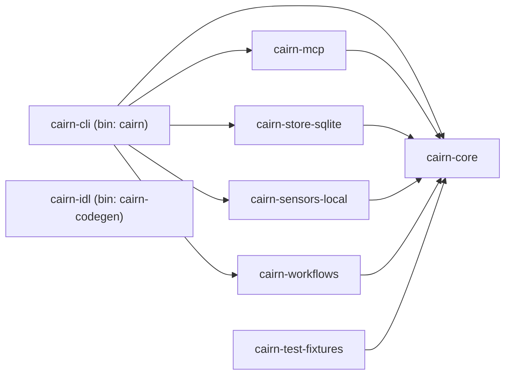

# Rust-First Workspace Scaffold — Design

**Date:** 2026-04-23
**Issue:** [#33](https://github.com/windoliver/cairn/issues/33) (parent [#3](https://github.com/windoliver/cairn/issues/3))
**Phase:** v0.1 — Minimum substrate (P0)
**Toolchain:** Rust 1.95.0, Edition 2024, Cargo resolver 3

## Goal

Stand up the P0 Rust workspace exactly shaped to accept the eight-verb implementation in later issues, with no TypeScript scaffolding, and with `cairn-core` provably isolated from adapter crates.

## Non-Goals

- Implementing any verb behaviour (`ingest`, `search`, etc.).
- Storage migrations, schema, or real sensor capture.
- TypeScript, Electron, desktop UI, harness bridges, or Temporal host.
- IDL content or real codegen logic — only a compiling shell.

## Acceptance Mapping

| Issue acceptance criterion | How this design satisfies it |
| --- | --- |
| `cargo metadata` sees every planned P0 member | Virtual root manifest lists all eight crates via `members = ["crates/*"]`. |
| Builds and tests without Node/TS toolchain | No `package.json`, `pnpm-workspace.yaml`, or Node hooks anywhere. CI uses only `cargo`. |
| `cairn-core` has no imports from `cairn-store-*`, `cairn-sensors-*`, `cairn-mcp-*`, or app crates | (a) `cairn-core/Cargo.toml` lists zero `cairn-*` deps (structural). (b) `scripts/check-core-boundary.sh` validates via `cargo metadata`. |
| Architecture note explains CLI / MCP / SDK / skill wrap the same verb layer and marks TypeScript surfaces deferred | `docs/design/architecture.md` with crate table, mermaid topology, and deferred-surface list. |

## Crate Topology

Eight crates. Arrow = `depends on` (runtime deps; dev-only deps marked separately).



`cairn-idl` is standalone — it owns the schema sources and a codegen binary. It does not depend on `cairn-core` (core consumes generated output; codegen is upstream of core). `cairn-test-fixtures` depends only on `cairn-core` and is consumed as a `dev-dependency` by other crates.

### Per-crate roles

| Crate | Role | Binary? |
| --- | --- | --- |
| `cairn-core` | Traits, generated types, pure pipeline functions, error enums. No I/O, no adapters. | — |
| `cairn-cli` | Terminal entry point. Wires adapters into the verb layer. | `cairn` |
| `cairn-mcp` | MCP adapter surface (stdio/http transports). | — |
| `cairn-store-sqlite` | SQLite + FTS5 + sqlite-vec record store adapter. | — |
| `cairn-sensors-local` | Local sensors (IDE hook, terminal, clipboard, voice, screen). | — |
| `cairn-workflows` | Background workflows host (consolidate, promote, expire, evaluate). | — |
| `cairn-idl` | Canonical IDL source files + codegen driver. | `cairn-codegen` |
| `cairn-test-fixtures` | Shared test helpers + loaders for `fixtures/` data. | — |

## Filesystem Layout

```
cairn/
├── Cargo.toml                     # virtual workspace manifest
├── rust-toolchain.toml            # pin 1.95.0
├── deny.toml                      # cargo-deny (license + security)
├── .cargo/config.toml             # build profile defaults
├── crates/
│   ├── cairn-core/
│   │   ├── Cargo.toml
│   │   └── src/lib.rs
│   ├── cairn-cli/
│   │   ├── Cargo.toml
│   │   └── src/main.rs
│   ├── cairn-mcp/
│   ├── cairn-store-sqlite/
│   ├── cairn-sensors-local/
│   ├── cairn-workflows/
│   ├── cairn-idl/
│   │   ├── Cargo.toml
│   │   ├── src/lib.rs
│   │   └── src/bin/cairn-codegen.rs
│   └── cairn-test-fixtures/
├── fixtures/                      # sample vaults, sqlite snapshots, sample markdown
├── docs/design/
│   ├── architecture.md
│   └── 2026-04-23-rust-workspace-scaffold-design.md
└── scripts/
    └── check-core-boundary.sh
```

## Root `Cargo.toml`

Virtual manifest. Key contents:

```toml
[workspace]
resolver = "3"
members = ["crates/*"]

[workspace.package]
version = "0.0.1"
edition = "2024"
rust-version = "1.95.0"
license = "Apache-2.0"
authors = ["Cairn contributors"]
repository = "https://github.com/windoliver/cairn"
homepage = "https://github.com/windoliver/cairn"
readme = "README.md"

[workspace.dependencies]
# Shared, pinned. No features at the workspace level — features opt in per crate.
# NOTE: rusqlite is intentionally held out of the P0 scaffold and lands with the
# storage implementation in issue #6. Pulling native SQLite into every workspace
# build before any code uses it widens the compilation and license surface
# unnecessarily.
serde = { version = "1", features = ["derive"] }
serde_json = "1"
thiserror = "2"
tokio = "1"
tracing = "0.1"
anyhow = "1"

# Internal crates — let members reference each other by workspace key.
cairn-core = { path = "crates/cairn-core" }
cairn-mcp = { path = "crates/cairn-mcp" }
cairn-store-sqlite = { path = "crates/cairn-store-sqlite" }
cairn-sensors-local = { path = "crates/cairn-sensors-local" }
cairn-workflows = { path = "crates/cairn-workflows" }
cairn-idl = { path = "crates/cairn-idl" }
cairn-test-fixtures = { path = "crates/cairn-test-fixtures" }

[workspace.lints.rust]
unsafe_code = "forbid"
missing_docs = "warn"
rust_2024_compatibility = { level = "deny", priority = -1 }

[workspace.lints.clippy]
pedantic = { level = "warn", priority = -1 }
# Intentional allows — noisy and low-signal for this codebase.
module_name_repetitions = "allow"
missing_errors_doc = "allow"
missing_panics_doc = "allow"
```

Every member `Cargo.toml` ends with:

```toml
[lints]
workspace = true
```

Enforced by PR review + (optionally later) the `cargo-workspace-lints` helper.

## `rust-toolchain.toml`

```toml
[toolchain]
channel = "1.95.0"
components = ["rustfmt", "clippy"]
profile = "minimal"
```

Pins contributors and CI to the exact compiler. `rustup` installs the channel on first `cargo` invocation.

## `.cargo/config.toml`

```toml
[build]
# Placeholder. Real profiles/target-dir tuning arrives with performance work.

[alias]
xtask-boundary = "run --quiet --manifest-path scripts/boundary/Cargo.toml"
```

Alias is reserved for a future Rust-based boundary checker if the shell script becomes limiting. Ship the shell version in P0 to avoid adding a crate just for this.

## `deny.toml`

Minimal P0 policy — tightened in later issues.

```toml
[licenses]
allow = [
    "Apache-2.0", "MIT", "BSD-3-Clause", "BSD-2-Clause", "ISC",
    "Unicode-DFS-2016", "Unicode-3.0", "MPL-2.0", "CC0-1.0", "Zlib",
]
confidence-threshold = 0.93

[bans]
multiple-versions = "warn"

[advisories]
yanked = "deny"
```

Note the non-obvious inclusions: `Unicode-3.0` (current license of `unicode-ident`, transitively pulled in by most proc-macro users), `MPL-2.0` (Mozilla-authored crates like `webpki-roots`), and `CC0-1.0` (e.g. `tiny-keccak`). Missing any of these breaks `cargo deny check licenses` on a routine Rust workspace; the allowlist is deliberately permissive at P0 and tightens in issue #158.

Not wired into CI by this issue; enablement tracked in #158.

## Boundary Enforcement

Two checks. Both must pass.

### Structural

`cairn-core/Cargo.toml` lists no `cairn-*` dependency. A reviewer can verify by reading one file. Any PR that adds such a dep fails the next check.

### `scripts/check-core-boundary.sh`

```bash
#!/usr/bin/env bash
set -euo pipefail

# Fail if cairn-core declares any cairn-* package as a dependency of any kind
# (normal, build, or dev). Core must stay a leaf: adapter crates never reach
# back into core, and core's own tests stay pure to keep the invariant
# trivially checkable.

cd "$(dirname "$0")/.."

violations=$(
  cargo metadata --format-version 1 --locked \
    | jq -r '
        .packages[]
        | select(.name == "cairn-core")
        | .dependencies[]
        | .name
        | select(startswith("cairn-"))
      '
)

if [[ -n "$violations" ]]; then
  echo "cairn-core depends on forbidden workspace crates:" >&2
  echo "$violations" >&2
  exit 1
fi

echo "cairn-core boundary OK"
```

- Queries the `packages` array (declared deps), not `resolve.nodes` (transitive closure). We care about what core asked for, not what it gets through others.
- **Every declared dependency kind is forbidden for `cairn-core`.** Adapter and app crates may dev-depend on `cairn-test-fixtures` (which itself depends on `cairn-core`); the script only scopes its check to `cairn-core`, so that downstream dev-dep usage is unaffected.
- `--locked` avoids rewriting `Cargo.lock` in CI.
- Script exit code drives the CI gate wired up in #158.

## Crate Stub Contents

Every lib crate ships with:

```rust
//! <One-line role statement from the crate table above.>
//!
//! P0 scaffold — no verb behaviour yet. Tracked by the implementation issues
//! that wrap the verb layer in `cairn-core`.

#![cfg_attr(not(test), deny(clippy::unwrap_used, clippy::expect_used))]
```

`cairn-cli/src/main.rs` — fails closed on every argv shape other than the three known-good ones (`[]`, `[--help|-h]`, `[--version|-V]`), so any wrapper that keys off exit status cannot mistake the scaffold for a real memory operation:

```rust
//! Cairn CLI entry point (P0 scaffold). Fails closed on every advertised
//! verb, unknown argument, and any trailing junk after `--help`/`--version`.

use std::process::ExitCode;

const VERBS: &[&str] = &[
    "ingest", "search", "retrieve", "summarize",
    "assemble_hot", "capture_trace", "lint", "forget",
];

fn main() -> ExitCode {
    let args: Vec<String> = std::env::args().skip(1).collect();
    match args.as_slice() {
        [] => { print_help(); ExitCode::SUCCESS }
        [f] if f == "--help" || f == "-h" => { print_help(); ExitCode::SUCCESS }
        [f] if f == "--version" || f == "-V" => {
            println!("cairn {}", env!("CARGO_PKG_VERSION"));
            ExitCode::SUCCESS
        }
        [verb, rest @ ..] if VERBS.contains(&verb.as_str()) => {
            eprintln!("cairn {verb}: not yet implemented in this P0 scaffold. ...");
            if !rest.is_empty() {
                eprintln!("cairn: ignored {n} trailing argument(s) — ...", n = rest.len());
            }
            ExitCode::from(2)
        }
        _ => {
            eprintln!("cairn: unrecognised argv {args:?}. Run `cairn --help` ...");
            ExitCode::from(2)
        }
    }
}
```

Gives `cargo run -p cairn-cli -- --version` a working smoke path while every verb invocation (`cairn ingest ...`) exits `2` with a not-implemented message on stderr.

`cairn-idl/src/bin/cairn-codegen.rs`:

```rust
//! Codegen entry point (P0 scaffold). Real IDL loading lands in #34.
fn main() {
    eprintln!("cairn-codegen: IDL source and generation land in issues #34 and #35.");
    std::process::exit(0);
}
```

`cairn-test-fixtures/src/lib.rs` exports a single `pub fn fixtures_dir() -> &'static std::path::Path` that resolves `CARGO_MANIFEST_DIR/../../fixtures`. Consumed only as a `dev-dependency` by adapter and app crates (`cairn-cli`, `cairn-mcp`, `cairn-store-sqlite`, `cairn-sensors-local`, `cairn-workflows`). **`cairn-core` does not depend on it** — core tests stay pure to keep the boundary check trivially sound.

## Architecture Note (`docs/design/architecture.md`)

Single page covering:

1. **Crate roster** — table mirroring the one in this spec.
2. **Dependency topology** — mermaid diagram above.
3. **Verb wrapping** — one paragraph stating that `cairn-cli`, `cairn-mcp`, any future Rust SDK export, and installable skill files each wrap the same verb functions defined in `cairn-core`; there is exactly one implementation per verb.
4. **Deferred non-Rust surfaces** — explicit list with the issue that will reactivate each:
   - TypeScript frontend — deferred until a concrete P1 UI issue.
   - Electron / desktop shell — deferred to P1 desktop issue.
   - Optional Temporal workflows host — deferred; `cairn-workflows` currently ships only an in-process runner.
   - Harness-specific packages (Claude Code / Cursor / Codex bridges) — deferred to their own integration issues.
5. **Plugin boundary statement** — `cairn-core` depends on zero adapter crates; every capability reaches core through a trait the core defines.

## Verification Checklist

Matches the issue's **Verification** list.

- `cargo metadata --format-version 1` — all eight members present.
- `cargo build --workspace` — green on stub.
- `cargo test --workspace` — green on stub (each crate ships at least one `#[test] fn smoke() {}`).
- `bash scripts/check-core-boundary.sh` — exits 0.
- `rg -l --hidden -g '!target' -g '!.git' '(package\.json|pnpm-workspace\.yaml|bun\.lockb)'` returns no results.
- Architecture note present and covers the four required bullets above.

## Risks & Open Questions

- **Workspace lints all-or-nothing.** Members cannot override individual workspace lints today (cargo#13157). If a specific crate needs a relaxation, we move that lint out of the workspace table into per-crate tables — accepted cost.
- **`cargo-workspace-lints` enforcement.** Not added in P0 — relying on review. Upgrade path is additive.
- **Codegen crate direction.** `cairn-idl` may later split into `cairn-idl` (schema) + `cairn-codegen` (tool). P0 keeps them together; split is a rename, cheap.
- **License of vendored C code.** Adding `sqlite-vec` and `candle` in later issues pulls in new license obligations — `deny.toml` will need review at that point.

## Out of Scope (restated)

- TypeScript / Electron / frontend / harness package scaffolding.
- Real IDL contents, codegen logic, verb behaviour, storage migrations, sensor capture.
- CI workflow YAML — tracked separately in #158.
