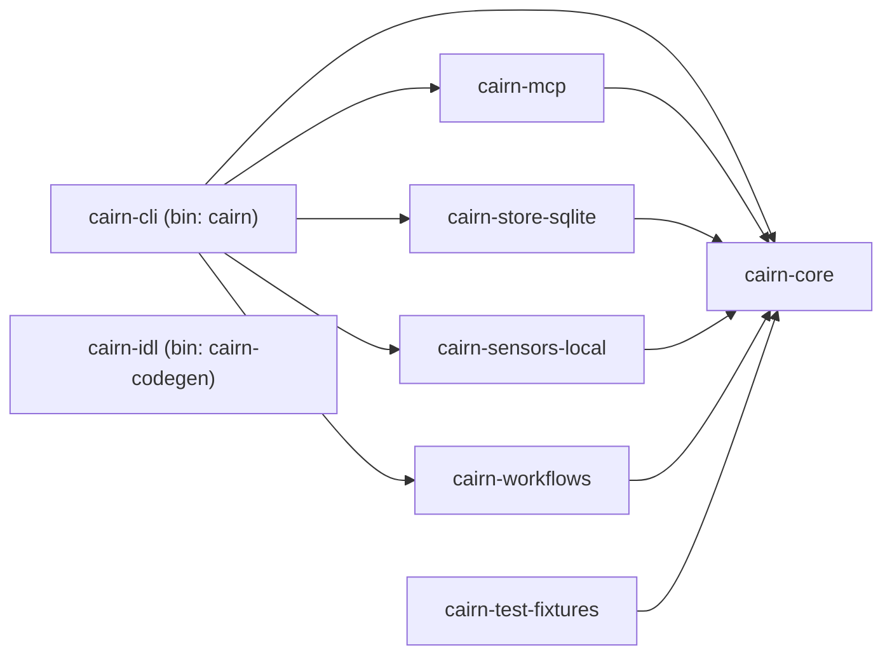

# Cairn P0 Architecture (Rust-First)

## Crate Roster

| Crate | Role | Binary? |
| --- | --- | --- |
| `cairn-core` | Traits, generated types, pure pipeline functions, error enums. No I/O, no adapters. | — |
| `cairn-cli` | Terminal entry point. Wires adapters into the verb layer. | `cairn` |
| `cairn-mcp` | MCP adapter surface (stdio/http transports). | — |
| `cairn-store-sqlite` | SQLite + FTS5 + sqlite-vec record store adapter. | — |
| `cairn-sensors-local` | Local sensors (IDE hook, terminal, clipboard, voice, screen). | — |
| `cairn-workflows` | Background workflows host (consolidate, promote, expire, evaluate). | — |
| `cairn-idl` | Canonical IDL source and codegen driver. | `cairn-codegen` |
| `cairn-test-fixtures` | Shared test helpers and fixture loaders. Dev-dep only. | — |

## Dependency Topology

`cairn-idl` is intentionally standalone: codegen is upstream of core. `cairn-test-fixtures` is consumed only as a `dev-dependency` by adapter and app crates — never by `cairn-core`.

## One Verb Layer, Four Surfaces

`cairn-cli`, `cairn-mcp`, any future Rust SDK re-exports, and installable skill files all wrap the **same** verb functions defined in `cairn-core`. There is exactly one implementation per verb. CLI and MCP are transport shells; the SDK surface is the public Rust API of `cairn-core` plus adapter traits; the installable skill is a thin wrapper that shells out to the `cairn` binary. No surface holds a parallel implementation.

## Plugin Boundary

`cairn-core` depends on zero adapter crates. Every capability reaches core through a trait that core itself defines. Adapters (`cairn-store-sqlite`, `cairn-sensors-local`, `cairn-mcp`, `cairn-workflows`) sit downstream and are wired at the application boundary (`cairn-cli`).

This is enforced by two mechanisms:
1. **Structural** — `cairn-core/Cargo.toml` lists no internal workspace crate as a dependency.
2. **Script** — `scripts/check-core-boundary.sh` runs `cargo metadata` and asserts that `cairn-core`'s declared dependencies contain no other `cairn-*` crate, **regardless of kind** (normal, build, or dev).

Core's own tests must stay pure: `cairn-core` never pulls in `cairn-test-fixtures` or any other adapter crate, even as a dev-dep. Adapter crates and the CLI are free to consume `cairn-test-fixtures` (which itself depends on `cairn-core`) as a `[dev-dependencies]` entry — the script only scopes its check to `cairn-core`, so dev-dep use downstream is not affected.

## Deferred Non-Rust Surfaces

Not present in P0. Each will be activated by its own issue.

| Surface | Activated by |
| --- | --- |
| TypeScript frontend | A concrete P1 UI issue. Not yet filed. |
| Electron / desktop shell | P1 desktop packaging issue. Not yet filed. |
| Optional Temporal workflows host | Deferred; `cairn-workflows` currently ships only an in-process runner shape. |
| Harness-specific packages (Claude Code, Cursor, Codex bridges) | Each harness integration gets its own issue. None required by P0. |
| Installable skill file (if authored in TS) | Skill distribution issue, P1+. The skill is a thin CLI wrapper, not a reimplementation. |

No P0 CI job needs `npm`, `pnpm`, `bun`, `node`, or any TypeScript toolchain.

## Toolchain

- Channel: `1.95.0` (pinned via `rust-toolchain.toml`)
- Edition: `2024`
- Cargo resolver: `"3"`
- Lints: workspace-level `[workspace.lints.rust]` and `[workspace.lints.clippy]`, each member inherits with `[lints] workspace = true`.
