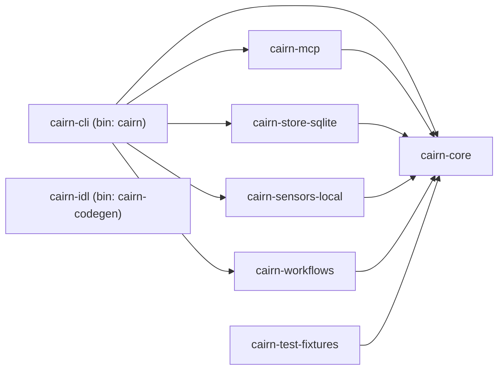

# Rust-First Workspace Scaffold Implementation Plan

> **For agentic workers:** REQUIRED SUB-SKILL: Use superpowers:subagent-driven-development (recommended) or superpowers:executing-plans to implement this plan task-by-task. Steps use checkbox (`- [ ]`) syntax for tracking.

**Goal:** Stand up the P0 Rust-first Cairn workspace — eight crates, pinned toolchain, lint policy, core boundary script, architecture note — with zero TypeScript and zero verb behaviour.

**Architecture:** Virtual Cargo workspace under `crates/*`. `cairn-core` is a leaf (no internal deps). Adapter/app crates depend on core only. `cairn-idl` is standalone. `cairn-test-fixtures` is consumed as a dev-dep by adapters + app, never by core. Toolchain pinned via `rust-toolchain.toml` to 1.95.0. Boundary enforced by (a) core's own `Cargo.toml` and (b) `scripts/check-core-boundary.sh`.

**Tech Stack:** Rust 1.95.0, Edition 2024, Cargo resolver 3, `serde`, `thiserror`, `tokio`, `tracing`, `anyhow`, `cargo-deny`, bash+jq for the boundary check. (`rusqlite` is intentionally held out of P0 and lands with the storage implementation in issue #6.)

**Spec:** `docs/design/2026-04-23-rust-workspace-scaffold-design.md`

---

## Prerequisites

- Working dir: `/Users/tafeng/cairn/.claude/worktrees/playful-twirling-pnueli`
- `rustup` installed with `1.95.0-aarch64-apple-darwin` toolchain available (already present — verified).
- `jq` available on PATH (macOS default or via `brew install jq`).
- `cargo-deny` NOT required for P0 to pass; the config is shipped but only invoked in #158.

---

## Task 1: Workspace root manifest + toolchain pin

**Files:**
- Create: `Cargo.toml`
- Create: `rust-toolchain.toml`
- Create: `.cargo/config.toml`
- Create: `.gitignore`

- [ ] **Step 1.1: Create `rust-toolchain.toml`**

Write `rust-toolchain.toml`:

```toml
[toolchain]
channel = "1.95.0"
components = ["rustfmt", "clippy"]
profile = "minimal"
```

- [ ] **Step 1.2: Create root `Cargo.toml` (virtual manifest)**

Write `Cargo.toml`:

```toml
[workspace]
resolver = "3"
members = ["crates/*"]

[workspace.package]
version = "0.0.1"
edition = "2024"
rust-version = "1.95.0"
license = "Apache-2.0"
authors = ["Cairn contributors"]
repository = "https://github.com/windoliver/cairn"
homepage = "https://github.com/windoliver/cairn"
readme = "README.md"

[workspace.dependencies]
serde = { version = "1", features = ["derive"] }
serde_json = "1"
thiserror = "2"
tokio = "1"
tracing = "0.1"
anyhow = "1"
# NOTE: rusqlite is intentionally held out of the P0 workspace deps. It lands
# with the storage implementation in issue #6.

cairn-core = { path = "crates/cairn-core" }
cairn-mcp = { path = "crates/cairn-mcp" }
cairn-store-sqlite = { path = "crates/cairn-store-sqlite" }
cairn-sensors-local = { path = "crates/cairn-sensors-local" }
cairn-workflows = { path = "crates/cairn-workflows" }
cairn-idl = { path = "crates/cairn-idl" }
cairn-test-fixtures = { path = "crates/cairn-test-fixtures" }

[workspace.lints.rust]
unsafe_code = "forbid"
missing_docs = "warn"
rust_2024_compatibility = { level = "deny", priority = -1 }

[workspace.lints.clippy]
pedantic = { level = "warn", priority = -1 }
module_name_repetitions = "allow"
missing_errors_doc = "allow"
missing_panics_doc = "allow"
```

- [ ] **Step 1.3: Create `.cargo/config.toml`**

Write `.cargo/config.toml`:

```toml
[build]
# Reserved for future performance tuning. Keep empty for P0.
```

- [ ] **Step 1.4: Create `.gitignore`**

Write `.gitignore`:

```
/target
/**/target
Cargo.lock.bak
*.swp
.DS_Store
```

Do **not** ignore `Cargo.lock` — this is a workspace with a binary, lockfile belongs in git.

- [ ] **Step 1.5: Verify the root manifest TOML parses**

Run: `cargo locate-project --workspace`

Expected: prints a JSON object with `"root"` pointing to the workspace `Cargo.toml`. An empty `crates/*` glob is fine at this point — `cargo locate-project` only validates the root manifest syntax, not membership.

If this fails with a TOML parse error, fix the root `Cargo.toml` before proceeding.

- [ ] **Step 1.6: Commit**

```bash
git add Cargo.toml rust-toolchain.toml .cargo/config.toml .gitignore
git commit -m "Scaffold Cargo workspace root and pin Rust 1.95.0"
```

---

## Task 2: `cairn-core` crate

**Files:**
- Create: `crates/cairn-core/Cargo.toml`
- Create: `crates/cairn-core/src/lib.rs`
- Create: `crates/cairn-core/tests/smoke.rs`

`cairn-core` is the boundary-sensitive crate. It lists **zero** internal dependencies. This task establishes the leaf.

- [ ] **Step 2.1: Write the failing smoke test**

Create `crates/cairn-core/tests/smoke.rs`:

```rust
//! Smoke test — confirms the crate compiles and re-exports the crate name.

#[test]
fn crate_name_is_cairn_core() {
    assert_eq!(env!("CARGO_PKG_NAME"), "cairn-core");
}
```

- [ ] **Step 2.2: Run the test to verify it fails**

Run: `cargo test -p cairn-core`

Expected: `error: package ID specification 'cairn-core' did not match any packages` (no such crate yet).

- [ ] **Step 2.3: Write `cairn-core/Cargo.toml`**

Create `crates/cairn-core/Cargo.toml`:

```toml
[package]
name = "cairn-core"
version.workspace = true
edition.workspace = true
rust-version.workspace = true
license.workspace = true
authors.workspace = true
repository.workspace = true
homepage.workspace = true
readme.workspace = true
description = "Cairn verb layer, domain types, and error enums. No I/O, no adapters."

[dependencies]
serde = { workspace = true }
thiserror = { workspace = true }

[lints]
workspace = true
```

Note: **no `cairn-*` dependencies**. This is the structural half of the boundary guarantee.

- [ ] **Step 2.4: Write `cairn-core/src/lib.rs`**

Create `crates/cairn-core/src/lib.rs`:

```rust
//! Cairn core — verb traits, domain types, and error enums.
//!
//! P0 scaffold. Verb behaviour, domain types, and error enums land in
//! follow-up issues (#4, #34, #35). Core depends on no adapter crate.

#![cfg_attr(not(test), deny(clippy::unwrap_used, clippy::expect_used))]
```

- [ ] **Step 2.5: Run the test to verify it passes**

Run: `cargo test -p cairn-core`

Expected: `test crate_name_is_cairn_core ... ok` — 1 passed.

- [ ] **Step 2.6: Commit**

```bash
git add crates/cairn-core Cargo.lock
git commit -m "Add cairn-core crate (leaf — no adapter deps)"
```

---

## Task 3: `cairn-mcp` crate

**Files:**
- Create: `crates/cairn-mcp/Cargo.toml`
- Create: `crates/cairn-mcp/src/lib.rs`
- Create: `crates/cairn-mcp/tests/smoke.rs`

- [ ] **Step 3.1: Write the failing smoke test**

Create `crates/cairn-mcp/tests/smoke.rs`:

```rust
#[test]
fn depends_on_core() {
    // If this compiles, the dep graph is wired correctly.
    let _ = cairn_core_is_linked();
}

fn cairn_core_is_linked() -> &'static str {
    // Touch the core crate to prove the dep works.
    // `cairn_core` has no public items yet, so we only rely on its linkage
    // via the compiler, not a specific symbol.
    concat!(env!("CARGO_PKG_NAME"), "+cairn-core")
}
```

- [ ] **Step 3.2: Run the test to verify it fails**

Run: `cargo test -p cairn-mcp`

Expected: `error: package ID specification 'cairn-mcp' did not match any packages`.

- [ ] **Step 3.3: Write `cairn-mcp/Cargo.toml`**

Create `crates/cairn-mcp/Cargo.toml`:

```toml
[package]
name = "cairn-mcp"
version.workspace = true
edition.workspace = true
rust-version.workspace = true
license.workspace = true
authors.workspace = true
repository.workspace = true
homepage.workspace = true
readme.workspace = true
description = "MCP adapter surface for the Cairn verb layer."

[dependencies]
cairn-core = { workspace = true }
serde = { workspace = true }
serde_json = { workspace = true }

[dev-dependencies]
cairn-test-fixtures = { workspace = true }

[lints]
workspace = true
```

- [ ] **Step 3.4: Write `cairn-mcp/src/lib.rs`**

Create `crates/cairn-mcp/src/lib.rs`:

```rust
//! Cairn MCP adapter — exposes the verb layer over MCP transports.
//!
//! P0 scaffold. Transport wiring and schema emission land in follow-up issues.

#![cfg_attr(not(test), deny(clippy::unwrap_used, clippy::expect_used))]
```

- [ ] **Step 3.5: Run the test to verify it passes**

Run: `cargo test -p cairn-mcp`

Expected: 1 passed. (Will fail until Task 8 provides `cairn-test-fixtures` — if it fails here with "no matching package `cairn-test-fixtures`", remove the `dev-dependencies` block temporarily and re-add it after Task 8. See "Ordering note" below.)

**Ordering note:** Tasks 3–7 each list `cairn-test-fixtures` as a dev-dep. If you execute tasks strictly in order, Task 8 hasn't landed yet and `cargo test` on Task 3 will fail resolution. Two options:
- **(a) Execute Task 8 first**, then 2, 3, 4, 5, 6, 7, 9. Dependency-topologically clean.
- **(b) Keep listed order** and temporarily omit the `[dev-dependencies]` block from Tasks 3–7, adding it back in a final pass after Task 8.

Option (a) is preferred. If you choose (a), re-order: 1 → 2 → 8 → 3 → 4 → 5 → 6 → 7 → 9 → 10 → 11 → 12. The content of each task is unchanged.

- [ ] **Step 3.6: Commit**

```bash
git add crates/cairn-mcp Cargo.lock
git commit -m "Add cairn-mcp adapter crate stub"
```

---

## Task 4: `cairn-store-sqlite` crate

**Files:**
- Create: `crates/cairn-store-sqlite/Cargo.toml`
- Create: `crates/cairn-store-sqlite/src/lib.rs`
- Create: `crates/cairn-store-sqlite/tests/smoke.rs`

- [ ] **Step 4.1: Write the failing smoke test**

Create `crates/cairn-store-sqlite/tests/smoke.rs`:

```rust
#[test]
fn crate_name_matches() {
    assert_eq!(env!("CARGO_PKG_NAME"), "cairn-store-sqlite");
}
```

- [ ] **Step 4.2: Run the test to verify it fails**

Run: `cargo test -p cairn-store-sqlite`

Expected: `error: package ID specification 'cairn-store-sqlite' did not match any packages`.

- [ ] **Step 4.3: Write `cairn-store-sqlite/Cargo.toml`**

Create `crates/cairn-store-sqlite/Cargo.toml`:

```toml
[package]
name = "cairn-store-sqlite"
version.workspace = true
edition.workspace = true
rust-version.workspace = true
license.workspace = true
authors.workspace = true
repository.workspace = true
homepage.workspace = true
readme.workspace = true
description = "SQLite + FTS5 + sqlite-vec record store adapter for Cairn."

[dependencies]
cairn-core = { workspace = true }
thiserror = { workspace = true }
# NOTE: rusqlite (with `bundled` feature) is intentionally held out of the P0
# scaffold. Pulling libsqlite3-sys/cc into every workspace build widens the
# native-compilation surface before any storage code uses it. The real dep
# lands with the storage implementation in issue #6.

[dev-dependencies]
cairn-test-fixtures = { workspace = true }

[lints]
workspace = true
```

Storage code and the `rusqlite`/`sqlite-vec` dependency join the crate in issue #6.

- [ ] **Step 4.4: Write `cairn-store-sqlite/src/lib.rs`**

Create `crates/cairn-store-sqlite/src/lib.rs`:

```rust
//! SQLite record store for Cairn.
//!
//! P0 scaffold. Schema, migrations, FTS5 and sqlite-vec integration arrive in
//! follow-up issues (#6 and later).

#![cfg_attr(not(test), deny(clippy::unwrap_used, clippy::expect_used))]
```

- [ ] **Step 4.5: Run the test to verify it passes**

Run: `cargo test -p cairn-store-sqlite`

Expected: 1 passed. (Compile is fast — the P0 scaffold has no native deps.)

- [ ] **Step 4.6: Commit**

```bash
git add crates/cairn-store-sqlite Cargo.lock
git commit -m "Add cairn-store-sqlite adapter crate stub"
```

---

## Task 5: `cairn-sensors-local` crate

**Files:**
- Create: `crates/cairn-sensors-local/Cargo.toml`
- Create: `crates/cairn-sensors-local/src/lib.rs`
- Create: `crates/cairn-sensors-local/tests/smoke.rs`

- [ ] **Step 5.1: Write the failing smoke test**

Create `crates/cairn-sensors-local/tests/smoke.rs`:

```rust
#[test]
fn crate_name_matches() {
    assert_eq!(env!("CARGO_PKG_NAME"), "cairn-sensors-local");
}
```

- [ ] **Step 5.2: Run the test to verify it fails**

Run: `cargo test -p cairn-sensors-local`

Expected: package-not-found error.

- [ ] **Step 5.3: Write `cairn-sensors-local/Cargo.toml`**

Create `crates/cairn-sensors-local/Cargo.toml`:

```toml
[package]
name = "cairn-sensors-local"
version.workspace = true
edition.workspace = true
rust-version.workspace = true
license.workspace = true
authors.workspace = true
repository.workspace = true
homepage.workspace = true
readme.workspace = true
description = "Local sensors (IDE hook, terminal, clipboard, voice, screen) for Cairn."

[dependencies]
cairn-core = { workspace = true }
tracing = { workspace = true }

[dev-dependencies]
cairn-test-fixtures = { workspace = true }

[lints]
workspace = true
```

- [ ] **Step 5.4: Write `cairn-sensors-local/src/lib.rs`**

Create `crates/cairn-sensors-local/src/lib.rs`:

```rust
//! Local sensors for Cairn — IDE hook, terminal, clipboard, voice, and screen.
//!
//! P0 scaffold. Real capture lands in follow-up issues.

#![cfg_attr(not(test), deny(clippy::unwrap_used, clippy::expect_used))]
```

- [ ] **Step 5.5: Run the test to verify it passes**

Run: `cargo test -p cairn-sensors-local`

Expected: 1 passed.

- [ ] **Step 5.6: Commit**

```bash
git add crates/cairn-sensors-local Cargo.lock
git commit -m "Add cairn-sensors-local adapter crate stub"
```

---

## Task 6: `cairn-workflows` crate

**Files:**
- Create: `crates/cairn-workflows/Cargo.toml`
- Create: `crates/cairn-workflows/src/lib.rs`
- Create: `crates/cairn-workflows/tests/smoke.rs`

- [ ] **Step 6.1: Write the failing smoke test**

Create `crates/cairn-workflows/tests/smoke.rs`:

```rust
#[test]
fn crate_name_matches() {
    assert_eq!(env!("CARGO_PKG_NAME"), "cairn-workflows");
}
```

- [ ] **Step 6.2: Run the test to verify it fails**

Run: `cargo test -p cairn-workflows`

Expected: package-not-found error.

- [ ] **Step 6.3: Write `cairn-workflows/Cargo.toml`**

Create `crates/cairn-workflows/Cargo.toml`:

```toml
[package]
name = "cairn-workflows"
version.workspace = true
edition.workspace = true
rust-version.workspace = true
license.workspace = true
authors.workspace = true
repository.workspace = true
homepage.workspace = true
readme.workspace = true
description = "Background workflows host (consolidate, promote, expire, evaluate) for Cairn."

[dependencies]
cairn-core = { workspace = true }
tokio = { workspace = true, features = ["rt", "macros"] }
tracing = { workspace = true }

[dev-dependencies]
cairn-test-fixtures = { workspace = true }

[lints]
workspace = true
```

- [ ] **Step 6.4: Write `cairn-workflows/src/lib.rs`**

Create `crates/cairn-workflows/src/lib.rs`:

```rust
//! Cairn background workflows host.
//!
//! P0 scaffold. Ships only the in-process runner shape; Temporal integration
//! is deferred to a later issue.

#![cfg_attr(not(test), deny(clippy::unwrap_used, clippy::expect_used))]
```

- [ ] **Step 6.5: Run the test to verify it passes**

Run: `cargo test -p cairn-workflows`

Expected: 1 passed.

- [ ] **Step 6.6: Commit**

```bash
git add crates/cairn-workflows Cargo.lock
git commit -m "Add cairn-workflows adapter crate stub"
```

---

## Task 7: `cairn-idl` crate + `cairn-codegen` binary

**Files:**
- Create: `crates/cairn-idl/Cargo.toml`
- Create: `crates/cairn-idl/src/lib.rs`
- Create: `crates/cairn-idl/src/bin/cairn-codegen.rs`
- Create: `crates/cairn-idl/tests/smoke.rs`

- [ ] **Step 7.1: Write the failing smoke test**

Create `crates/cairn-idl/tests/smoke.rs`:

```rust
#[test]
fn crate_name_matches() {
    assert_eq!(env!("CARGO_PKG_NAME"), "cairn-idl");
}
```

- [ ] **Step 7.2: Run the test to verify it fails**

Run: `cargo test -p cairn-idl`

Expected: package-not-found error.

- [ ] **Step 7.3: Write `cairn-idl/Cargo.toml`**

Create `crates/cairn-idl/Cargo.toml`:

```toml
[package]
name = "cairn-idl"
version.workspace = true
edition.workspace = true
rust-version.workspace = true
license.workspace = true
authors.workspace = true
repository.workspace = true
homepage.workspace = true
readme.workspace = true
description = "Cairn canonical IDL source and codegen driver. Standalone — no core dep."

[[bin]]
name = "cairn-codegen"
path = "src/bin/cairn-codegen.rs"

[dependencies]
serde = { workspace = true }
serde_json = { workspace = true }

[lints]
workspace = true
```

`cairn-idl` does **not** depend on `cairn-core` — codegen is upstream of core (core consumes generated output in future issues).

- [ ] **Step 7.4: Write `cairn-idl/src/lib.rs`**

Create `crates/cairn-idl/src/lib.rs`:

```rust
//! Cairn IDL source and codegen driver.
//!
//! P0 scaffold. Real IDL content lands in #34; generators land in #35.

#![cfg_attr(not(test), deny(clippy::unwrap_used, clippy::expect_used))]
```

- [ ] **Step 7.5: Write `cairn-idl/src/bin/cairn-codegen.rs`**

The codegen binary **must fail closed** until real generation exists. Any build script, CI step, or release automation that shells out to it cannot be allowed to treat missing schema generation as complete.

Create `crates/cairn-idl/src/bin/cairn-codegen.rs`:

```rust
//! Codegen entry point (P0 scaffold). IDL load + emit land in #34, #35.
//!
//! Fails closed — exits with a not-implemented status so any build script,
//! CI step, or release automation that shells out to `cairn-codegen` cannot
//! silently treat schema generation as complete.

use std::process::ExitCode;

fn main() -> ExitCode {
    eprintln!(
        "cairn-codegen: not yet implemented. IDL source and generation land \
         in issues #34 and #35; no files were loaded or emitted."
    );
    ExitCode::from(2)
}
```

Extend `crates/cairn-idl/tests/smoke.rs` with a fail-closed assertion:

```rust
#[test]
fn codegen_binary_fails_closed() {
    let bin = env!("CARGO_BIN_EXE_cairn-codegen");
    let out = std::process::Command::new(bin).output().expect("cairn-codegen");
    assert!(!out.status.success(), "cairn-codegen exited OK — should fail closed");
    assert_eq!(out.status.code(), Some(2), "wrong exit code");
    let stderr = String::from_utf8(out.stderr).expect("utf-8 stderr");
    assert!(stderr.contains("not yet implemented"), "stderr: {stderr:?}");
    let stdout = String::from_utf8(out.stdout).expect("utf-8 stdout");
    assert!(stdout.is_empty(), "scaffold must not print to stdout: {stdout:?}");
}
```

- [ ] **Step 7.6: Run the tests to verify they pass**

Run: `cargo test -p cairn-idl`

Expected: 2 passed (`crate_name_matches` + `codegen_binary_fails_closed`).

- [ ] **Step 7.7: Verify the binary fails closed**

Run: `cargo run -p cairn-idl --bin cairn-codegen; echo "exit=$?"`

Expected stderr: `cairn-codegen: not yet implemented. ...`
Expected exit code: **2** (not 0).

- [ ] **Step 7.8: Commit**

```bash
git add crates/cairn-idl Cargo.lock
git commit -m "Add cairn-idl crate with cairn-codegen stub binary"
```

---

## Task 8: `cairn-test-fixtures` crate + `fixtures/` dir

**Files:**
- Create: `crates/cairn-test-fixtures/Cargo.toml`
- Create: `crates/cairn-test-fixtures/src/lib.rs`
- Create: `crates/cairn-test-fixtures/tests/fixtures_dir.rs`
- Create: `fixtures/README.md`

> **Important:** If you picked Option (a) from the Task 3 ordering note, execute this task right after Task 2 (before Tasks 3–7).

- [ ] **Step 8.1: Create `fixtures/` placeholder**

Create `fixtures/README.md`:

```markdown
# Cairn test fixtures

Sample vaults, markdown, and SQLite snapshots used by crate tests.

Consumed through the `cairn-test-fixtures` crate's `fixtures_dir()` helper.
Real fixtures land with the storage and verb-behaviour issues.
```

- [ ] **Step 8.2: Write the failing `fixtures_dir` test**

Create `crates/cairn-test-fixtures/tests/fixtures_dir.rs`:

```rust
//! Confirms `fixtures_dir()` resolves to the workspace `fixtures/` directory
//! and that the directory exists on disk.

use std::path::PathBuf;

#[test]
fn fixtures_dir_resolves_and_exists() {
    let dir = cairn_test_fixtures::fixtures_dir();
    assert!(dir.is_absolute(), "fixtures_dir should be absolute, got {dir:?}");
    assert!(dir.exists(), "fixtures dir should exist on disk, got {dir:?}");
    assert!(dir.is_dir(), "fixtures dir should be a directory, got {dir:?}");
    assert_eq!(
        dir.file_name().and_then(|s| s.to_str()),
        Some("fixtures"),
        "fixtures dir should be named `fixtures`, got {dir:?}",
    );

    // README planted in Step 8.1 must be visible through the helper.
    let readme: PathBuf = dir.join("README.md");
    assert!(readme.is_file(), "fixtures/README.md should exist, got {readme:?}");
}
```

- [ ] **Step 8.3: Run the test to verify it fails**

Run: `cargo test -p cairn-test-fixtures`

Expected: package-not-found error.

- [ ] **Step 8.4: Write `cairn-test-fixtures/Cargo.toml`**

Create `crates/cairn-test-fixtures/Cargo.toml`:

```toml
[package]
name = "cairn-test-fixtures"
version.workspace = true
edition.workspace = true
rust-version.workspace = true
license.workspace = true
authors.workspace = true
repository.workspace = true
homepage.workspace = true
readme.workspace = true
description = "Shared test helpers and fixture loaders for Cairn crates."

[dependencies]
cairn-core = { workspace = true }

[lints]
workspace = true
```

- [ ] **Step 8.5: Write `cairn-test-fixtures/src/lib.rs`**

Create `crates/cairn-test-fixtures/src/lib.rs`:

```rust
//! Shared test helpers for Cairn crates.
//!
//! Only ever pulled in as a `dev-dependency`. `cairn-core` does not depend on
//! this crate — core tests stay pure so the boundary check remains trivially
//! sound.

#![cfg_attr(not(test), deny(clippy::unwrap_used, clippy::expect_used))]

use std::path::{Path, PathBuf};
use std::sync::OnceLock;

/// Absolute path to the workspace-level `fixtures/` directory.
///
/// Resolves at runtime from `CARGO_MANIFEST_DIR` (this crate's dir) and walks
/// up to the workspace root. Cached after first call.
#[must_use]
pub fn fixtures_dir() -> &'static Path {
    static DIR: OnceLock<PathBuf> = OnceLock::new();
    DIR.get_or_init(|| {
        // CARGO_MANIFEST_DIR is this crate: <workspace>/crates/cairn-test-fixtures
        // Walk up two levels to the workspace root, then into `fixtures/`.
        let manifest_dir = Path::new(env!("CARGO_MANIFEST_DIR"));
        let workspace_root = manifest_dir
            .ancestors()
            .nth(2)
            .expect("crates/cairn-test-fixtures must be two levels below the workspace root");
        workspace_root.join("fixtures")
    })
    .as_path()
}
```

- [ ] **Step 8.6: Run the test to verify it passes**

Run: `cargo test -p cairn-test-fixtures`

Expected:
```
test fixtures_dir_resolves_and_exists ... ok
```

- [ ] **Step 8.7: Commit**

```bash
git add crates/cairn-test-fixtures fixtures Cargo.lock
git commit -m "Add cairn-test-fixtures crate and fixtures/ dir"
```

---

## Task 9: `cairn-cli` crate (bin: `cairn`)

**Files:**
- Create: `crates/cairn-cli/Cargo.toml`
- Create: `crates/cairn-cli/src/main.rs`
- Create: `crates/cairn-cli/tests/cli.rs`

- [ ] **Step 9.1: Write the failing CLI behaviour tests**

The scaffold CLI **must fail closed**: any advertised verb, any unknown argument, and any trailing junk after `--help`/`--version` must exit with code `2` and leave `stdout` empty. Only `[]`, `[--help|-h]`, and `[--version|-V]` succeed.

Create `crates/cairn-cli/tests/cli.rs`:

```rust
//! End-to-end CLI smoke tests. Invokes the built `cairn` binary and asserts
//! the P0 stub behaviour: help/version succeed, verbs fail closed.

use std::process::Command;

/// Path to the built CLI binary. Cargo sets `CARGO_BIN_EXE_<name>` for every
/// binary in the current crate at test-compile time.
fn cli() -> Command {
    Command::new(env!("CARGO_BIN_EXE_cairn"))
}

#[test]
fn prints_version_with_flag() {
    let out = cli().arg("--version").output().expect("cairn --version");
    assert!(out.status.success(), "exit: {:?}", out.status);
    let stdout = String::from_utf8(out.stdout).expect("utf-8 stdout");
    assert!(stdout.starts_with("cairn "), "got: {stdout:?}");
    assert!(stdout.contains(env!("CARGO_PKG_VERSION")), "got: {stdout:?}");
}

#[test]
fn default_prints_help_listing_all_eight_verbs() {
    let out = cli().output().expect("cairn");
    assert!(out.status.success(), "exit: {:?}", out.status);
    let stdout = String::from_utf8(out.stdout).expect("utf-8 stdout");
    for verb in [
        "ingest", "search", "retrieve", "summarize",
        "assemble_hot", "capture_trace", "lint", "forget",
    ] {
        assert!(
            stdout.contains(verb),
            "help output missing verb {verb}, got:\n{stdout}",
        );
    }
}

#[test]
fn help_flag_matches_default() {
    let out = cli().arg("--help").output().expect("cairn --help");
    assert!(out.status.success(), "exit: {:?}", out.status);
    let stdout = String::from_utf8(out.stdout).expect("utf-8 stdout");
    assert!(stdout.contains("ingest"), "got:\n{stdout}");
}

#[test]
fn known_verb_fails_closed() {
    for verb in [
        "ingest", "search", "retrieve", "summarize",
        "assemble_hot", "capture_trace", "lint", "forget",
    ] {
        let out = cli().arg(verb).output().expect("cairn <verb>");
        assert!(!out.status.success(), "verb {verb} exited OK — should fail closed");
        assert_eq!(out.status.code(), Some(2), "verb {verb} wrong exit code");
        let stderr = String::from_utf8(out.stderr).expect("utf-8 stderr");
        assert!(
            stderr.contains("not yet implemented"),
            "verb {verb} stderr missing not-implemented marker: {stderr:?}",
        );
        let stdout = String::from_utf8(out.stdout).expect("utf-8 stdout");
        assert!(
            stdout.is_empty(),
            "verb {verb} printed to stdout (caller might swallow stderr): {stdout:?}",
        );
    }
}

#[test]
fn unknown_argument_fails_closed() {
    let out = cli().arg("--definitely-not-a-flag").output().expect("cairn");
    assert!(!out.status.success(), "exit: {:?}", out.status);
    assert_eq!(out.status.code(), Some(2));
    let stderr = String::from_utf8(out.stderr).expect("utf-8 stderr");
    assert!(stderr.contains("unrecognised argv"), "got: {stderr:?}");
}

#[test]
fn trailing_arg_after_help_or_version_fails_closed() {
    for (a, b) in [
        ("--version", "--definitely-not-a-flag"),
        ("-V", "--definitely-not-a-flag"),
        ("--help", "--definitely-not-a-flag"),
        ("-h", "ingest"),
        ("-V", "ingest"),
    ] {
        let out = cli().arg(a).arg(b).output().expect("cairn");
        assert!(
            !out.status.success(),
            "`cairn {a} {b}` must fail closed, got exit: {:?}",
            out.status,
        );
        assert_eq!(out.status.code(), Some(2));
        let stderr = String::from_utf8(out.stderr).expect("utf-8 stderr");
        assert!(
            stderr.contains("unrecognised argv"),
            "`cairn {a} {b}` missing unrecognised marker: {stderr:?}",
        );
    }
}

#[test]
fn trailing_arg_after_verb_still_fails_closed() {
    let out = cli().args(["ingest", "payload"]).output().expect("cairn");
    assert!(!out.status.success(), "exit: {:?}", out.status);
    assert_eq!(out.status.code(), Some(2));
    let stderr = String::from_utf8(out.stderr).expect("utf-8 stderr");
    assert!(stderr.contains("not yet implemented"), "got: {stderr:?}");
    assert!(stderr.contains("trailing"), "got: {stderr:?}");
}
```

- [ ] **Step 9.2: Run the test to verify it fails**

Run: `cargo test -p cairn-cli`

Expected: package-not-found error.

- [ ] **Step 9.3: Write `cairn-cli/Cargo.toml`**

Create `crates/cairn-cli/Cargo.toml`:

```toml
[package]
name = "cairn-cli"
version.workspace = true
edition.workspace = true
rust-version.workspace = true
license.workspace = true
authors.workspace = true
repository.workspace = true
homepage.workspace = true
readme.workspace = true
description = "Cairn terminal entry point. Wires adapters into the verb layer."

[[bin]]
name = "cairn"
path = "src/main.rs"

[dependencies]
cairn-core = { workspace = true }
cairn-mcp = { workspace = true }
cairn-store-sqlite = { workspace = true }
cairn-sensors-local = { workspace = true }
cairn-workflows = { workspace = true }
anyhow = { workspace = true }

[dev-dependencies]
cairn-test-fixtures = { workspace = true }

[lints]
workspace = true
```

- [ ] **Step 9.4: Write `cairn-cli/src/main.rs`**

Create `crates/cairn-cli/src/main.rs`:

```rust
//! Cairn CLI entry point (P0 scaffold).
//!
//! Real command dispatch lands when the verb layer does. Until then the
//! binary fails closed on every advertised verb, unknown argument, and any
//! malformed argv — including trailing junk after `--help` or `--version`.
//! Any caller relying on exit status cannot mistake a scaffold for a real
//! memory operation.

use std::process::ExitCode;

const VERBS: &[&str] = &[
    "ingest",
    "search",
    "retrieve",
    "summarize",
    "assemble_hot",
    "capture_trace",
    "lint",
    "forget",
];

fn main() -> ExitCode {
    // Skip argv[0] (the program name). Everything after that must match one
    // of the expected shapes exactly.
    let args: Vec<String> = std::env::args().skip(1).collect();
    match args.as_slice() {
        [] => {
            print_help();
            ExitCode::SUCCESS
        }
        [flag] if flag == "--help" || flag == "-h" => {
            print_help();
            ExitCode::SUCCESS
        }
        [flag] if flag == "--version" || flag == "-V" => {
            println!("cairn {}", env!("CARGO_PKG_VERSION"));
            ExitCode::SUCCESS
        }
        [verb, rest @ ..] if VERBS.contains(&verb.as_str()) => {
            eprintln!(
                "cairn {verb}: not yet implemented in this P0 scaffold. \
                 The verb layer lands in follow-up issues; no memory \
                 operation was performed."
            );
            if !rest.is_empty() {
                eprintln!(
                    "cairn: ignored {n} trailing argument(s) — argv parsing \
                     arrives with the verb layer.",
                    n = rest.len()
                );
            }
            ExitCode::from(2)
        }
        _ => {
            eprintln!(
                "cairn: unrecognised argv {args:?}. Run `cairn --help` for \
                 the list of verbs this scaffold advertises (all currently \
                 return a not-implemented error)."
            );
            ExitCode::from(2)
        }
    }
}

fn print_help() {
    println!("cairn {} — P0 scaffold", env!("CARGO_PKG_VERSION"));
    println!();
    println!("Verbs (not yet implemented — every verb exits 2):");
    for v in VERBS {
        println!("  cairn {v}");
    }
}
```

- [ ] **Step 9.5: Run the test to verify it passes**

Run: `cargo test -p cairn-cli`

Expected: 7 tests pass (`prints_version_with_flag`, `default_prints_help_listing_all_eight_verbs`, `help_flag_matches_default`, `known_verb_fails_closed`, `unknown_argument_fails_closed`, `trailing_arg_after_help_or_version_fails_closed`, `trailing_arg_after_verb_still_fails_closed`).

- [ ] **Step 9.6: Smoke-run the binary**

Run: `cargo run -p cairn-cli -- --version`

Expected stdout: `cairn 0.0.1`

- [ ] **Step 9.7: Commit**

```bash
git add crates/cairn-cli Cargo.lock
git commit -m "Add cairn-cli crate with cairn bin and version/help stub"
```

---

## Task 10: Architecture note

**Files:**
- Create: `docs/design/architecture.md`

This document satisfies the issue's "architecture note" acceptance criterion.

- [ ] **Step 10.1: Write `docs/design/architecture.md`**

Create `docs/design/architecture.md`:

```markdown
# Cairn P0 Architecture (Rust-First)

## Crate Roster

| Crate | Role | Binary? |
| --- | --- | --- |
| `cairn-core` | Traits, generated types, pure pipeline functions, error enums. No I/O, no adapters. | — |
| `cairn-cli` | Terminal entry point. Wires adapters into the verb layer. | `cairn` |
| `cairn-mcp` | MCP adapter surface (stdio/http transports). | — |
| `cairn-store-sqlite` | SQLite + FTS5 + sqlite-vec record store adapter. | — |
| `cairn-sensors-local` | Local sensors (IDE hook, terminal, clipboard, voice, screen). | — |
| `cairn-workflows` | Background workflows host (consolidate, promote, expire, evaluate). | — |
| `cairn-idl` | Canonical IDL source and codegen driver. | `cairn-codegen` |
| `cairn-test-fixtures` | Shared test helpers and fixture loaders. Dev-dep only. | — |

## Dependency Topology



`cairn-idl` is intentionally standalone: codegen is upstream of core. `cairn-test-fixtures` is consumed only as a `dev-dependency` by adapter and app crates — never by `cairn-core`.

## One Verb Layer, Four Surfaces

`cairn-cli`, `cairn-mcp`, any future Rust SDK re-exports, and installable skill files all wrap the **same** verb functions defined in `cairn-core`. There is exactly one implementation per verb. CLI and MCP are transport shells; the SDK surface is the public Rust API of `cairn-core` plus adapter traits; the installable skill is a thin wrapper that shells out to the `cairn` binary. No surface holds a parallel implementation.

## Plugin Boundary

`cairn-core` depends on zero adapter crates. Every capability reaches core through a trait that core itself defines. Adapters (`cairn-store-sqlite`, `cairn-sensors-local`, `cairn-mcp`, `cairn-workflows`) sit downstream and are wired at the application boundary (`cairn-cli`).

This is enforced by two mechanisms:
1. **Structural** — `cairn-core/Cargo.toml` lists no internal workspace crate as a dependency.
2. **Script** — `scripts/check-core-boundary.sh` runs `cargo metadata` and asserts that `cairn-core`'s declared dependencies contain no other `cairn-*` crate, **regardless of kind** (normal, build, or dev).

## Deferred Non-Rust Surfaces

Not present in P0. Each will be activated by its own issue.

| Surface | Activated by |
| --- | --- |
| TypeScript frontend | A concrete P1 UI issue. Not yet filed. |
| Electron / desktop shell | P1 desktop packaging issue. Not yet filed. |
| Optional Temporal workflows host | Deferred; `cairn-workflows` currently ships only an in-process runner shape. |
| Harness-specific packages (Claude Code, Cursor, Codex bridges) | Each harness integration gets its own issue. None required by P0. |
| Installable skill file (if authored in TS) | Skill distribution issue, P1+. The skill is a thin CLI wrapper, not a reimplementation. |

No P0 CI job needs `npm`, `pnpm`, `bun`, `node`, or any TypeScript toolchain.

## Toolchain

- Channel: `1.95.0` (pinned via `rust-toolchain.toml`)
- Edition: `2024`
- Cargo resolver: `"3"`
- Lints: workspace-level `[workspace.lints.rust]` and `[workspace.lints.clippy]`, each member inherits with `[lints] workspace = true`.
```

- [ ] **Step 10.2: Commit**

```bash
git add docs/design/architecture.md
git commit -m "Add P0 architecture note (crate roster, topology, deferred surfaces)"
```

---

## Task 11: Boundary script + `deny.toml`

**Files:**
- Create: `scripts/check-core-boundary.sh`
- Create: `deny.toml`

- [ ] **Step 11.1: Write `scripts/check-core-boundary.sh`**

Create `scripts/check-core-boundary.sh`:

```bash
#!/usr/bin/env bash
#
# Fail if cairn-core declares any cairn-* package as a dependency of any kind
# (normal, build, or dev). Core must stay a leaf: adapter crates never reach
# back into core, and core's own tests stay pure to keep this invariant
# trivially checkable.

set -euo pipefail

cd "$(dirname "$0")/.."

if ! command -v jq >/dev/null 2>&1; then
  echo "check-core-boundary: jq is required but not installed" >&2
  exit 2
fi

# Emit every dep declared by cairn-core whose name starts with `cairn-`,
# regardless of kind. An empty result means clean.
violations=$(
  cargo metadata --format-version 1 --locked \
    | jq -r '
        .packages[]
        | select(.name == "cairn-core")
        | .dependencies[]
        | .name
        | select(startswith("cairn-"))
      '
)

if [[ -n "$violations" ]]; then
  echo "FAIL: cairn-core depends on forbidden workspace crates:" >&2
  echo "$violations" | sed 's/^/  - /' >&2
  exit 1
fi

echo "cairn-core boundary OK"
```

Why `.packages[]` instead of `.resolve.nodes[]`: the `packages` array lists **declared** dependencies, which is what we care about — we want to know what core asked for, not the transitive closure. Why accept every kind (no dev-dep exemption): the script is already scoped to `cairn-core` only, so declaring a forbidden dev-dep on core would silently pass an exemption-based check. Since core's tests are kept pure by policy, there is no legitimate reason for core to dev-depend on any other workspace crate.

- [ ] **Step 11.2: Make the script executable**

Run: `chmod +x scripts/check-core-boundary.sh`

- [ ] **Step 11.3: Run the script — expect success**

Run: `./scripts/check-core-boundary.sh`

Expected stdout: `cairn-core boundary OK`
Expected exit code: 0.

- [ ] **Step 11.4: Sanity-check the script catches a violation**

This is a temporary edit — you will revert it in the next step.

Edit `crates/cairn-core/Cargo.toml`, add under `[dependencies]`:

```toml
cairn-store-sqlite = { workspace = true }
```

Run: `./scripts/check-core-boundary.sh`

Expected exit code: 1. Expected stderr includes:
```
FAIL: cairn-core depends on forbidden workspace crates:
  - cairn-store-sqlite
```

- [ ] **Step 11.5: Revert the sanity-check edit**

Remove the `cairn-store-sqlite` line from `crates/cairn-core/Cargo.toml`.

Run: `./scripts/check-core-boundary.sh`

Expected: `cairn-core boundary OK` — exit 0.

Run: `git diff crates/cairn-core/Cargo.toml`

Expected: no output (clean revert).

- [ ] **Step 11.6: Write `deny.toml`**

Create `deny.toml`:

```toml
# cargo-deny policy for Cairn. Not wired into CI in this issue; enablement
# tracked in #158.

[licenses]
allow = [
    "Apache-2.0",
    "MIT",
    "BSD-3-Clause",
    "BSD-2-Clause",
    "ISC",
    "Unicode-DFS-2016",
    "Unicode-3.0",
    "MPL-2.0",
    "CC0-1.0",
    "Zlib",
]
confidence-threshold = 0.93

[bans]
multiple-versions = "warn"

[advisories]
yanked = "deny"
```

- [ ] **Step 11.7: Commit**

```bash
git add scripts/check-core-boundary.sh deny.toml
git commit -m "Add core boundary check script and cargo-deny policy"
```

---

## Task 12: End-to-end verification

This task performs the checks in the issue's **Verification** section. No code changes; only assertions over what the previous tasks produced. If any step fails, diagnose and fix before proceeding — do not mark the task complete.

- [ ] **Step 12.1: `cargo metadata` sees every planned member**

Run:

```bash
cargo metadata --format-version 1 --no-deps --locked \
  | jq -r '.packages[].name' \
  | sort
```

Expected output (eight lines, bare crate names):
```
cairn-cli
cairn-core
cairn-idl
cairn-mcp
cairn-sensors-local
cairn-store-sqlite
cairn-test-fixtures
cairn-workflows
```

With `--no-deps`, `.packages[]` is exactly the workspace members. Do not read `.workspace_members[]` directly — on Cargo 1.95 that emits package IDs like `path+file:///.../crates/cairn-cli#0.0.1`, not the bare name.

If the count is wrong or a name is missing, the corresponding task's Cargo.toml did not commit — go back and fix.

- [ ] **Step 12.2: Workspace builds clean**

Run: `cargo build --workspace --locked`

Expected: green. No warnings treated as errors beyond what the lint table requires.

- [ ] **Step 12.3: Workspace tests green**

Run: `cargo test --workspace --locked`

Expected: all per-crate smoke tests pass, `cairn-cli` tests pass, `cairn-test-fixtures` test passes. Total ≥ 10 tests.

- [ ] **Step 12.4: Clippy clean at workspace lint level**

Run: `cargo clippy --workspace --all-targets --locked -- -D warnings`

Expected: exits 0. If clippy flags the stubs, prefer allowing the specific lint on the offending item over loosening the workspace policy.

- [ ] **Step 12.5: Core boundary holds**

Run: `./scripts/check-core-boundary.sh`

Expected: `cairn-core boundary OK`.

- [ ] **Step 12.6: No Node/TS toolchain files present**

Run:

```bash
rg --files --hidden -g '!.git' -g '!target' \
  | rg -i '^(package\.json|pnpm-workspace\.yaml|pnpm-lock\.yaml|bun\.lockb|yarn\.lock|package-lock\.json|tsconfig\.json)$'
```

Expected: no output.

- [ ] **Step 12.7: Architecture note covers required bullets**

Open `docs/design/architecture.md` and confirm it contains:
1. Every Rust crate with a one-line role.
2. A dependency topology diagram.
3. Explicit statement that CLI, MCP, SDK, and skill wrap the same verb layer.
4. Explicit "deferred non-Rust surfaces" list.

- [ ] **Step 12.8: Final commit (if any formatting fixes happened)**

```bash
git status
```

Expected: `nothing to commit, working tree clean`.

If clippy or formatting fixes landed during 12.2–12.4, commit them:

```bash
git add -A
git commit -m "Apply clippy and format fixes from scaffold verification"
```

- [ ] **Step 12.9: Push and open PR**

```bash
git push -u origin worktree-playful-twirling-pnueli
gh pr create --title "Scaffold Rust-first workspace and app boundaries (#33)" --body "$(cat <<'EOF'
## Summary

- Adds the P0 eight-crate Rust workspace described in issue #33
- Pins toolchain to 1.95.0 and edition 2024
- Introduces `cairn-core` boundary script (structural + metadata check)
- Ships architecture note at `docs/design/architecture.md`
- No TypeScript / Node / pnpm anywhere — deferred surfaces enumerated in the note

Closes #33.

## Test plan

- [ ] `cargo metadata --format-version 1` lists all eight members
- [ ] `cargo build --workspace --locked` green
- [ ] `cargo test --workspace --locked` green
- [ ] `cargo clippy --workspace --all-targets --locked -- -D warnings` green
- [ ] `./scripts/check-core-boundary.sh` prints `cairn-core boundary OK`
- [ ] No `package.json` / `pnpm-workspace.yaml` / `tsconfig.json` in tree
EOF
)"
```

---

## Execution order recap (recommended)

`1 → 2 → 8 → 3 → 4 → 5 → 6 → 7 → 9 → 10 → 11 → 12`

Topologically clean: `cairn-test-fixtures` exists before any crate tries to dev-dep it.

## Post-implementation

- Update `README.md` status line — no longer "design-stage only", but still pre-behaviour. (Minor edit; out of this plan's scope, do as a follow-up PR if desired.)
- File follow-up sub-issues (#34, #35, #143, #158) against this scaffold.
